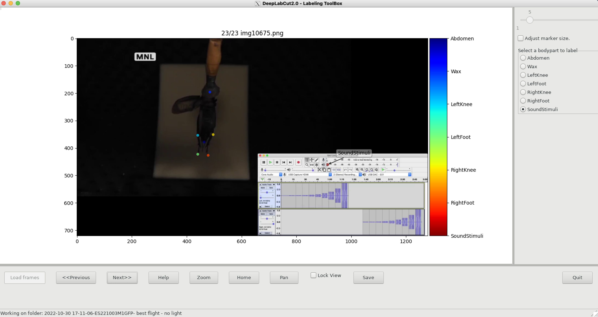
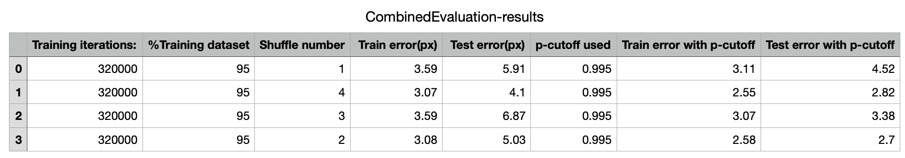

# Steps to use DLC on Bowdoin's HPC

This guide was written to help with the basics of getting DLC up and running. For the most detailed user guide, DLC offers a very handy one located at: https://github.com/DeepLabCut/DeepLabCut/blob/main/docs/standardDeepLabCut_UserGuide.md

I suggest reading through this entire Markdown and if any specific questions remain, take a look at DLC's user guide.

### Step 1: Downloading necessary software
  1.1: Download the latest verion of [XQUARTZ](https://www.xquartz.org/) to your MacOS computer (peferably 2.8+)
  - Will use following code in future to check status of GUI (graphic user interface) ``` $ xeyes ```
  
  1.2: If you are on campus:
  - Make sure you are connected to the Bowdoin Wifi (must be Bowdoin, not Bowdoin-Guest or Bowdoin-PSK)
  
  1.3: If you are off campus:
  - Log into the Bowdoin [VPN](https://bowdoin.teamdynamix.com/TDClient/1814/Portal/KB/ArticleDet?ID=99743)


### Step 2: Accessing the Bowdoin HPC through interactive server
  2.1: Open terminal on MacOS
  
  2.2: Log in with your Bowdoin credentials with the SSH sever
  - Can either use @dover, @foxcroft, or @slurm

  -  Example code:
  ```terminal
  dhcp-195-230:~ eansmall$ ssh -Y [username]@dover.bowoin.edu
  [username]@dover.bowdoin.edu's password: [enter your password here]
  ```
  - To make sure the graphic user interface (GUI), we need to submit following line of code:
  ```
  $ xeyes
  ```
  - This code should result in a pair of eyes pop-up that tracks your mouse. You can exit that screen, but now your GUI should work
  
  2.3: Now, we want to access the correct filepath (directory)
      - we can use the ```cd``` feature to quickly move around in terminal's filepaths like the following (once entering a few letters, use the tab key to       fill in the rest instead of writing out your file path each time)
  ``` terminal
  cd /mnt/research/hhorch/[username]
  ```
  - We are now in your HPC-research directory

  - Other helpful tips with terminal

      - To view current directory: ```cd .```
  
      - To move one directory backwards: ```cd ..```
  
      - Instead of writing out the entire file path to your [username] directory, you can access sub directories to your current directory as follows:
  ```
  [esmall2@dover /mnt/research/hhorch/esmall2]$ cd ./practice_DLC
  [esmall2@dover /mnt/research/hhorch/esmall2/practice_DLC]$
  ```
  - Now you are in a subdirectory of your [username] directory
  
  - To view the contents of each directory by name use: ```ls .```
  
  - To view contents with more detail use: ```ls -l```
  
  - To make a new directory manually: ```mkdir [name of directory]```
        
  - To copy materials manually: ```cp [filepath of file] [filepath of destination]```
      

### Step 3: creating DeepLabCut (DLC) environments and running ipython to use DLC on HPC interactive servers

3.1: We first need to create a DLC environment: this is activating a local python environment with DLC version 2.2

``` source /mnt/local/python-venv/dlc-2.2/bin/activate ```

3.2: Next, we need to open a virtual python environment:

``` ipython ```

3.3: Python is now open and you should be prompted with the following:

```python
In [1]: 
```
- Here, you can import deeplabcut with the following code and click return:

```python
In [1]: import deeplabcut
"DLC loaded in light mode; you cannot use any GUI (labeling, relabeling and standalone GUI)"
```

### Step 4: creating DeepLabCut (DLC) project, extract frames, label frames, and train your network
4.1: Now, lets start using DLC to create a new project with the following code:

```python
In [2]: deeplabcut.create_new_project('name of project', 'your name', ['complete file path to video'], (optional) working_directory='file path to where you want project saved')
```
  - additional parameter includes:
      - ```copy_videos=True/False``` which will create a reference to a video in the video directory

4.2: Great, your new project is created, but lets save the filepath to the configuration file (config.yaml) as a variable

```python
In [3]: config_path = '/mnt/research/hhorch/[username]/[working directory]' 
```

4.3: We can now extract frames:
    - This may take a few moments, but you should see the frames being counted
    - You will primarily use 'automatic' and 'kmeans' as the parameters, but these are default, so you don't always have to fill them in
```python
In [4]: deeplabcut.extract_frames(config_path, 'automatic/manual', 'uniform/kmeans')
"Do you want to extract (perhaps additional) frames for [file path]? yes/no" yes 
...
"Kmeans clustering (this may take a while)"
...
"Frames were successfully extracted, for the videos listed in the config.yaml file."
"You can now label the frames using the function 'label_frames' (Note, you should label frames extracted from diverse videos (and many videos; we do not recommend training on single videos!))."
```

A real example would look like the following: 
```python
deeplabcut.extract_frames(config, mode='automatic')
"Config file read successfully."
"Do you want to extract (perhaps additional) frames for video: /mnt/research/hhorch/esmall2/Explore-the-space/stim01-trained-ELS-2022-06-09/videos/2020-10-27 09-38-34 201026UM1 stim01.mkv ? yes/no" [type your response here] yes

"Kmeans-quantization based extracting of frames from 0.0  seconds to 178.23  seconds."
"Extracting and downsampling... 10694  frames from the video."
"10694it [01:44, 102.62it/s]"
```
If you are extracting frames for a second time, it will prompt you with the following
```python
"The directory already contains some frames. Do you want to add to it?(yes/no):" yes
```
 
  - additional paramerters include: 
    - ```python crop=True/False``` which can crop the video if True
    - ```python userFeedback=True/False``` which will ask the user to process a specific video before doing so

4.4: This gives us the frames, now we can label them:

```python
In [5]: deeplabcut.label_frames(path_config)
```

 You can now label each bodypart for each frame before training the network


NOTE: I was using a marker size of 12 for each training before this. I changed it to 5 to be more precise, whihc I think will ultimately be more accurate. 

4.5: Before training the network, let's make sure our labels were correctly placed:

```python
In [6]: deeplabcut.check_labels(path_config)
"Creating images with labels by [your name]."
"100%|████████████████████████████████████████████████████████████████████████████| 19/19 [00:13<00:00,  1.41it/s]"
"If all the labels are ok, then use the function 'create_training_dataset' to create the training dataset!"
```

4.6: Finally, let's create a training dataset
```python
In [7]: deeplabcut.create_training_dataset(path_config)
"The training dataset is successfully created. Use the function 'train_network' to start training. Happy training!"
```
4.7: Great! Now we can start training the network.
  

### Step 5: Training the network using Bowdoin's GPU computers (ie Moosehead)
All of this is located [here](https://hpc.bowdoin.edu/hpcwiki/index.php?title=Linuxhelp:Deeplabcut) as well

1. Now we need to log into Bowdoin's @slurm or @moosehead GPU servers with the following. Open a new terminal window and login within the following:
``` terminal
ssh -Y [username]@moosehead.bowdoin.edu
[username]@moosehead's password: [enter password]
```
  - Unlike @dover and @foxcroft, we have to pass scripts (.sh files) to the HPC so that it can perfom high performance computing using the GPU's (which     allow for larger capacities of data
  - You can find all of the scipts and python files in the [HPC_scripts](https://github.com/esmall2023/DLC_HPC/tree/main/HPC_scripts) folder in this repository.

2. You then need to submit this "job" to the cluster with the following code:

```terminal
sbatch -p gpu --gres=gpu:rtx3080:1 --mem=32G training_script.sh
```

### Step 6: Evaluating the network, analyzing novel videos, and filtering predictions
Once we have trained our network as in step 6, we want to evaluate the network to see how well it was trained. There are parameters called Train error and Test Error. For the sake of our experiment and from my research (which was very hard to find), if the train and test error are close to eachother (in pixels) and they are both close to, or below 4 px, then the training is sufficient. You can also create labeled videos to determine whether DLC was able to accurately locate each body part throughout the video.

1. Evaluating the network: we do so the same way as training the network with the script file. Make sure you are in the right directory where your HPC_scripts are like this:  /mnt/research/hhorch/esmall2/Explore-the-space/stim01-trained-ELS-2022-06-09/HPC_Scripts

```terminal
sbatch -p gpu --gres=gpu:rtx3080:1 --mem=32G evaluate_script.sh
```
- For ```Shuffles[1]``` in evaluate_network.py, you will want to change this for each shuffle that you did. For example, if you set Shuffles=3 when training the network, then submit this script when Shuffles=[1], Shuffles=[2], and Shuffles=[3]. 




### Step 7: Re-training the network if it wasn't trained well enough

1. In order to do so, we will typically want to add new/more videos to our training dataset with the following code:

```
deeplabcut.add_new_videos(config, ['full path to each specific video'])
```

#### NOTE: I tried just using the path to the file containing all of the videos, but it didn't work so I had to add each new video individually

2. Once you've added the new videos, you can repeat steps 4.3 and beyond.
  


