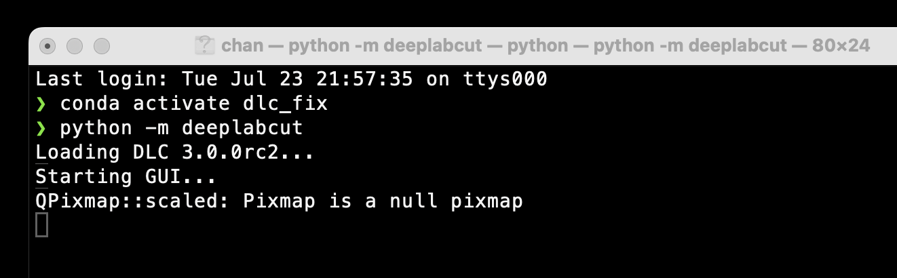
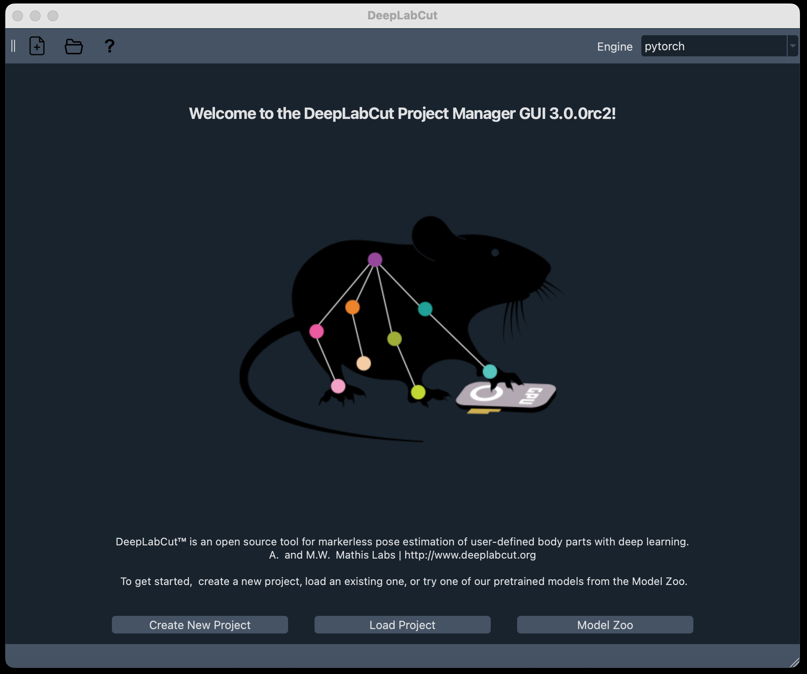

# Using DeepLabCut on Bowdoin's Environment - Before DeepLabCut

This guide was based on the older version of DLC guide from Ean Small '23, written to help with the basics of getting DLC up and running. For the most detailed user guide, [DLC offers a very handy one.](https://github.com/DeepLabCut/DeepLabCut/blob/main/docs/standardDeepLabCut_UserGuide.md)

> Note that as of July-August 2024, DeepLabCut is going though a transition to DLC 3.0 with new features and PyTorch[^1] as the backend. This guide is based on DeepLabCut 3.0.0rc4, which is the latest version as of August 2024.

## Right tools for the right job

There's multiple ways to use DeepLabCut, technically all of the processes can be done on your laptop/local machine. However, it will take a painstaking time to process and train the model on a chromebook or the chromebook equivalent of our M2 MacBook Pros. However, for some less computational intensive tasks, local machines is far more than enough and don't have the overhead of submitting and waiting for outputs of the HPC. Here's a overview of what is an HPC job and what is more of a local job:

| Local Job (Computationally Light) | HPC's GPU Job (Needs a GPU) | HPC's CPU Job (CPU intensive) |
|------------------------------------|-----------------------------|-------------------------------|
| Create a project | Training a model | Create Labeled Data |
| Labelling with GUI | Evaluating model | Extracting outlier frames |
| Create training datasets | Analyzing videos | Plotting Trajectories |
|  |  | Filtering Predictions |

- Local Jobs
  - Takes seconds to minutes to run, and
  - Needs a lot of interactions with DLC's GUI, or
  - it's not worth is to submit a job to the HPC for such a small task.
- HPC's GPU Jobs
  - Interacts with the GPU for machine learning, and
  - takes a long time to run.
  - **Unless you know what you're doing, don't run this on your local machine.**
- HPC's CPU Jobs
  - Interacts with the CPU for processing, and
  - Probably needs a lot of memory.
  - **Unless you know what you're doing, don't run this on your local machine.**

## Setting up the environment on your computer

This section helps you to install DeepLabCut on you computer, althought it is a generally good practice to put all research data and DLC models on microwave, labelling in DeepLabCut works best when you have DeepLabCut on your computer. The offical guide of DeepLabCut recommend using a conda environment[^2] might scary at first espeically if you're not familiar with it, but it's a great way to manage your dependencies and not mess up your system's python.

- [ ] Install miniconda3 on your computer. (If you have [homebrew](https://brew.sh/)[^3], run `brew install miniconda3`)
- [ ] Download the config file from DLC's website: [Link here](https://github.com/DeepLabCut/DeepLabCut/blob/main/conda-environments/DEEPLABCUT.yaml#:~:text=Raw%20file%20content-,Download,-%E2%8C%98)
- [ ] Navigate to where you downloaded the file in terminal[^4], and run `conda env create -f DEEPLABCUT.yaml`. This will create a new conda environment with all the dependencies you need for DLC.

Whenever you want to interact with DeepLabCut on your machine:

1. Run `conda activate DEEPLABCUT` to activate the environment. (If you named it differently, replace `DEEPLABCUT` with the name you gave it.)
2. Run `python -m deeplabcut` to start the GUI.
3. Alternatively, run `ipython` for a interactive python environment, then run `import deeplabcut`. A constantly changing software like DeepLabCut might have some features that are not in the GUI yet, so it's good to know how to interact with it in the terminal.

## Setting up the environment on the HPC

Coincidentally Bowdoin HPC is also under going a transition to a new system, so the following steps might be outdated. However, the general idea is the same. I took sometimes to get conda and dlc 3.0.0 to work on the HPC.

1. Open terminal on macOS. (If you're on a window laptop, try using [WSL](https://docs.microsoft.com/en-us/windows/wsl/install) or [PuTTY](https://www.putty.org/) for a shell)
2. Log in with your Bowdoin credentials with the SSH sever
3. Learn to navigate through terminal. Here's a useful reference courtesy of [Professor Sean Barker](https://tildesites.bowdoin.edu/~sbarker/unix/)
4. Learn to use the HPC. Best way to know how to use the current HPC setup is [Bowdoin's HPC Website](https://hpc.bowdoin.edu)

You can either use @dover, @foxcroft, @slurm, or @moosehead
Example code:

```sh
dhcp-195-230:~ eansmall$ ssh -Y [username]@dover.bowoin.edu
... (There will be some text here)
[username]@dover.bowdoin.edu's password: [enter your password here]
```

> replace `[username]` with your username!

---

# 3 Ways to use DeepLabCut

## GUI (Graphic User Interface)

Get a user friendly interface to interact with DLC.

In your terminal, activate the conda environment and start deeplabcut as a module:

```bash
conda activate DEEPLABCUT # assume it's named DEEPLABCUT
python -m deeplabcut
```


You'll see see those lines in the terminal (it takes around 2 minutes to start up): and you'll see a GUI pop up.



To load the existing project, you'll need to know where the project is saved: (I reckon the create new project button explains itself)

[A small video on how to load a project](./images/load_a_project.mov)

## Command Line Interface

GUI is great, but there's lots of things that you can't change in the GUI. Interact in the command line is the best way.

### Interactive iPython

```bash
conda activate DEEPLABCUT
ipython
...
```

Just like you need to load a project in the GUI, you need the same path to `config.yaml` to do stuff in the any python environment.

```python
In [1]: import deeplabcut
>>> Loading DeepLabCut 3.0.0rc2
In [2]: config_path = "/path/to/config.yaml"
In [3]: deeplabcut.your_functions(config_path, arguments)
```

### Slurm Jobs for HPC

Similarly, you can submit a job to the HPC to do the heavy lifting. My hope is that those scripts that comes with the repo will help you get started.

```bash
ssh moosehead # depending on your system settings, you might need to enter your bowdoin login.
[name@moosehead] cd /path/to/your/project
[name@moosehead] sbatch your_script.sh
```

In your script, you'll need to do few things:

1. Request the correct resources. [Not sure how to do that?](https://hpc.bowdoin.edu/hpcwiki/index.php?title=Linuxhelp:SlurmclusterRL9)
2. Load the correct environment. (Similar to how `conda activate DEEPLABCUT` works)
3. Run python scripts that contains the DLC functions.

#### Example of a DLC script

This is a small example of training a network on the HPC. I have two files in my `/HPC_scripts` folder: `training_script.sh` and `train_network.py`.

In `training_script.sh`:

```bash
#!/bin/bash
#SBATCH --mail-type=BEGIN,END,FAIL -p gpu --gres=gpu:rtx3080:1 --mem=32G 

export PATH=/mnt/local/python-venv/dlc-2.3.9/bin:/mnt/local/cuda-11.8/bin:$PATH
export LD_LIBRARY_PATH=/mnt/local/python-venv/dlc-2.3.9/lib/python3.9/site-packages/nvidia/cudnn/lib:/mnt/local/python-venv/dlc-2.3.9/lib/python3.9/site-packages/tensorrt_libs:/mnt/local/cuda-11.8/lib64:$LD_LIBRARY_PATH
source /mnt/local/python-venv/dlc-2.3.9/bin/activate

export DLClight="True";
python -u ./train.py
```

When I run `sbatch training_script.sh`, the first section request a GPU `-p gpu --gres=gpu:rtx3080:1` and 32GB of memory `--mem=32G`. The next section is to load the correct environment (That section is `conda activate DEEPLABCUT`), and the last section is to run the python script.

In `train_network.py`:

```python
import deeplabcut

config_path = '/put/your/project/directory/here/config.yaml'

deeplabcut.train_network(
  config_path, 
  shuffle=1
) 
```

This part actually called the `train_network` function from DLC, and starts the training process. Two emails will be sent to you for notifications: one when the job starts, and one when the job ends. To check how the job is doing, check the `slurm-???.out` file generated.

This should cover all the questions on how to get started with DeepLabCut. The next step is to use DeepLabCut for a project, I have [a step-by-step guide that is based on Ean's old guide.](./Getting-started-DLC.md).

[^1]: **What is PyTorch?** PyTorch is a machine learning library that is used in DeepLabCut 3.0 to run the computer vision model (ResNet) used for pose estimation. It is a popular library for machine learning and is used in many research projects. Compares to Tensorflow (the previous backend for DeepLabCut), PyTorch is more flexible and easier to use, and has been widely adapted to academic research.

[^2]: **What is conda?**: Conda, miniconda, and anaconda are package managers, they help install dependencies (All additional software and scripts that are needed for a program to run) for DeepLabCut. Conda keeps all those software in an isolated environment so it doesn't mess up anything else on your computer.

[^3]: **What is homebrew?**: Imagine App Store, but better. You can install homebrew [on their offical website.](https://brew.sh/)

[^4]: Not sure how to do that? [This small Guide from the CS dept would help.](https://tildesites.bowdoin.edu/~sbarker/unix/)
