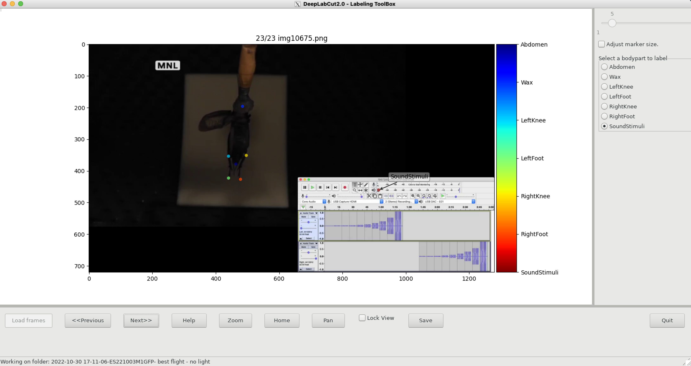
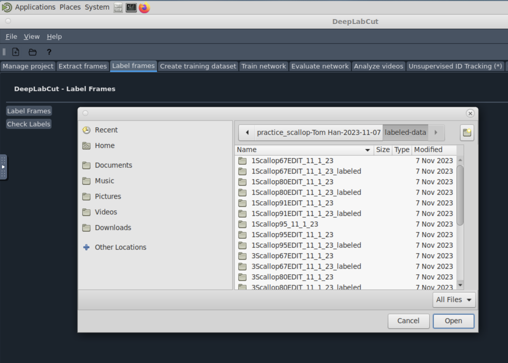
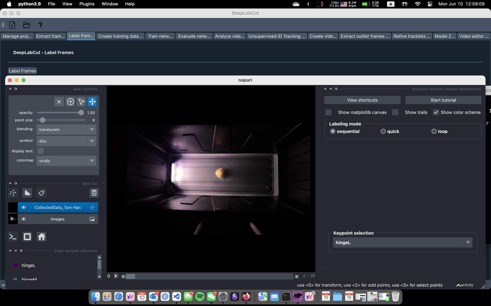
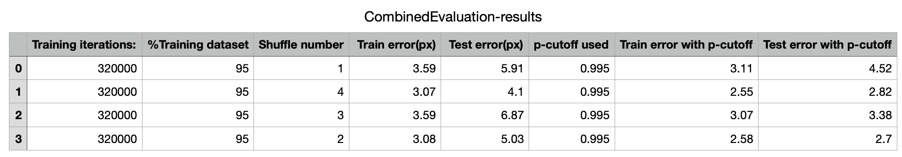

# Steps to use DLC on Bowdoin's HPC

This guide was written to help with the basics of getting DLC up and running. For the most detailed user guide, [DLC offers a very handy one.](https://github.com/DeepLabCut/DeepLabCut/blob/main/docs/standardDeepLabCut_UserGuide.md) I attached links to the specific sections of the user guide that correspond to each step, so if there's something you don't understand, you can refer to the user guide for more information.

I suggest reading through this entire Markdown and if any specific questions remain, take a look at DLC's user guide.

This guide is still a work in progress, as there's a lot of information to cover. If you have any questions, feel free to [reach out to me(Tom)](mailto:chan@bowdoin.edu). 

- [ ] Update the guide to include a full directions for DLC using the new GUI. 
- [ ] Explaining each step's purpose and what it does.
- [ ] Add a section about [3D projects](https://deeplabcut.github.io/DeepLabCut/docs/Overviewof3D.html#d-overview) and how to set them up. (This might need to be a separated document). 

> With the new version of DeepLabCut's GUI, you can now use the GUI on Bowdoin's HPC. **If you decided to use the GUI, step 1-3 is not necessary.**

## Step 1.ALT: Use interactive server with GUI: 

> Skip this step if you:
> - Are **not planning on** using the new version of DeepLabCut's GUI. **OR**
> - Read [the updated guide on Bowdoin's HPC wiki about deeplabcut](https://hpc.bowdoin.edu/hpcwiki/index.php?title=Linuxhelp:Deeplabcut#New_2024_Slurm_HPC_Cluster). 

### Step 1.1: Connect to the HPC

Login to the [HPC Web Portal](https://newhpcweb.bowdoin.edu) at https://newhpcweb.bowdoin.edu using your Bowdoin login name **(not email address, no `@bowdoin.edu`)** and password.

Select the Interactive Applications menu and choose the "Bowdoin HPC Desktop", request a session with at least 16GB of memory. Press the Blue Launch button. Wait several seconds as the Cluster sets up the job, then press the blue Launch Bowdoin HPC Desktop button.

> [Not working as of Jun 06 2024]: Alternatively, choose "Bowdoin HPC Desktop with GPU" if you wish to do GPU intensive steps (labelling data is not GPU intensive, but training the network is). This includes everything mentioned in Step 6. 

> [**TODO**]: Include a picture of that desktop and terminal. 

### Step 1.2: Get to DeepLabCut GUI

Once you get to open a Linux shell by going to the Applications menu, Systems Tools, then MATE Terminal. In the terminal, run the following command to activate the DLC environment:

```bash
run-deeplabcut-2.3.9
```

This should bring up an iPython interface (look for `In [1]`) on your terminal. Once in the iPython interface, you can run the following command to open the GUI:

```python
In [1]: import deeplabcut
# There's gonna be some warning messages popping out, you can safely ignore any messages about "Tensorflow binary optimizations", "Unable to register cuBLAS", and "networkx backend definted more than once"
In [2]: deeplabcut.launch_dlc()
# This line would open the GUI in a new window
```

Once you get to the GUI, you can follow the rest of the steps in the GUI starting from Step 4.

## Step 1: Downloading Necessary Software for DLC

> Skip this step if you:
> - Are using the new version of DeepLabCut's GUI, **OR**
> - Already have XQUARTZ installed, and
> - Are on campus and connected to the Bowdoin network.

1.1: Download the latest verion of [XQUARTZ](https://www.xquartz.org/) to your MacOS computer (peferably 2.8+)
- Use following code to check if it works `$ xeyes`, there should be an window with two eyes 👀. 
- If you're using homebrew on your computer, run `brew install --casks xquartz` would be an easy way out. 

1.2.1: If you are on campus:
- Make sure you are connected to the Bowdoin network (must be **Bowdoin** or **eduroam**, not Bowdoin-Guest or Bowdoin-PSK)

1.2.2: If you are off campus:
- Log into the [Bowdoin VPN](https://bowdoin.teamdynamix.com/TDClient/1814/Portal/KB/ArticleDet?ID=99743)

## Step 2: Accessing the Bowdoin HPC through interactive server

> Skip this step if you:
> - Are using the new version of DeepLabCut's GUI, **OR**
> - Are already familiar with using terminal on macOS or alternative shell on Windows, and
> - Have used Bowdoin HPC before. 

2.1: Open terminal on macOS. (If you're on a window laptop, try using [WSL](https://docs.microsoft.com/en-us/windows/wsl/install) or [PuTTY](https://www.putty.org/) for a shell)

2.2: Log in with your Bowdoin credentials with the SSH sever
- Can either use @dover, @foxcroft, or @slurm

-  Example code:
```
dhcp-195-230:~ eansmall$ ssh -Y [username]@dover.bowoin.edu
... (There will be some text here)
[username]@dover.bowdoin.edu's password: [enter your password here]
```
> - `-Y` here is needed to estabilish a X11 connection (which enables display)! 
> - replace `[username]` with your username!
> - If you're on Bowdoin's network **and** using your Bowdoin laptop or logged into your account on a Bowdoin computer, you can simpify this to `ssh -Y dover`. 

- To make sure the graphic user interface (GUI) works, you should run the following command on your terminal: 
```
[chan@dover ~]$ xeyes
```
- This code should result in a pair of eyes pop-up that tracks your mouse. You can exit that screen, but now your GUI should work. 
- If the eyes does not pops out, if could be an issue with XQUARTZ configuretion. To check that, open XQuartz, Go to Settings > Security > and ENABLE the checkbox "Allow connections from network clients". After enabling, restart Xquartz and restart your computer.

2.3: Now, we want to access the correct filepath (directory)

we can use the `cd` feature to quickly move around in terminal's filepaths like the following (once entering a few letters, use the tab key to fill in the rest instead of writing out your file path each time)
```
[chan@dover ~]$ cd /mnt/research/hhorch/[username]
```
- We are now in your HPC-research directory

### Other helpful tips with terminal
| Command | Description |
| --- | --- |
| `cd .` | View current directory |
| `cd ..` | Move one directory backwards |
| `cd ./practice_DLC` | Access subdirectories (in this case, `practive_DLC`) of your current directory |
| `ls` | View the contents of each directory by name |
| `ls -l` | View contents with more detail |
| `mkdir [name of directory]` | Make a new directory manually |
| `cp [filepath of file] [filepath of destination]` | Copy materials manually |
| `rm [filepath of file]` | Remove files manually |
| `rm -r [filepath of directory]` | Remove directories manually |

## Step 3: creating DeepLabCut (DLC) environments and running ipython to use DLC on HPC interactive servers

> Skip this step if you:
> - Are using the new version of DeepLabCut's GUI, **OR**
> - Read and understood the [DLC user guide on Bowdoin's HPC website](https://hpc.bowdoin.edu/hpcwiki/index.php?title=Linuxhelp:Deeplabcut). 

### 3.1: Create a DLC environment
We first need to create a DLC environment: this is activating a local python environment with DLC version 2.2, and open a virtual python environment:

```
[chan@dover ~]$ source /mnt/local/python-venv/dlc-2.2/bin/activate
(dlc) [chan@dover ~]$ ipython
```
> - The `(dlc)` in the terminal indicates that you are in the DLC environment.
> - The `ipython` command takes a while to load, so if you didn't see the `In [1]:` prompt, wait around 30 seconds before trying again.
> - You might encounter this warning message, which is fine. 
```
(dlc) [chan@dover ~]$ ipython
/mnt/local/python-venv/dlc-2.2.1-gui/lib/python3.9/site-packages/IPython/core/interactiveshell.py:852: UserWarning: Attempting to work in a virtualenv. If you encounter problems, please install IPython inside the virtualenv.
  warn(
```

### 3.2: Python is now open and you should be prompted with the following:

```python
In [1]: 
```
- Here, you can import deeplabcut with the following code and click return:

```python
In [1]: import deeplabcut
```

> If you see an warning message like: `"DLC loaded in light mode; you cannot use any GUI (labeling, relabeling and standalone GUI)"`, double check that you have the `-Y` flag in your ssh command.
> If you see any kinds of `FutureWarning` or `DeprecationWarning`, you can ignore them (for now). 

## Step 4: creating DeepLabCut (DLC) project, extract frames, label frames, and train your network

### 4.1: Create a new project [Link to DLC's User Guide on this step](https://deeplabcut.github.io/DeepLabCut/docs/standardDeepLabCut_UserGuide.html#a-create-a-new-project)
Now, lets start using DLC to create a new project with the following code:

```python
In [2]: deeplabcut.create_new_project('name of project', 'your name', ['complete file path to video'], (optional) working_directory='file path to where you want project saved')
```
- additional parameter that might be useful includes:
    - `copy_videos=True/False`: which will create a reference to a video in the video directory, if you want to copy the video to the project directory, set this to True. 

### 4.2: Save the configuration profile
Great, your new project is created, but lets save the filepath to the configuration file (config.yaml) as a variable. 

> This part is optional, but would save you a lot of time in the future and codes below will assume you have done this step. 

```python
In [3]: config_path = '/mnt/research/hhorch/[username]/[working directory]/config.yaml' 
```

> Alternatively, `config_path` is also returned when you call `create_new_project` function, so you can technically combine those two lines into one like this: Note that DeepLabCut team might change this in the future. 
> ```python
> In [1]: config_path = deeplabcut.create_new_project('name of project', 'your name', ['complete file path to video'], (optional) working_directory='file path to where you want project saved')
> ```
### 4.3: Extract frames from the video. [Link to DLC's User Guide on this step](https://deeplabcut.github.io/DeepLabCut/docs/standardDeepLabCut_UserGuide.html#c-data-selection-extract-frames)
We can now extract frames:
  - This may take a few moments, but you should see the frames being counted
  - You will primarily use 'automatic' and 'kmeans' as the parameters, but these are default, so you don't always have to fill them in
  - For some reasons, this line is sensitive to case and/or the difference between double and single quote. (use `'automatic'` instead of `"automatic"` or `'Automatic'`)

```python
In [4]: deeplabcut.extract_frames(config_path, 'automatic/manual', 'uniform/kmeans')
"Do you want to extract (perhaps additional) frames for [file path]? yes/no" yes 
...
"Kmeans clustering (this may take a while)"
...
"Frames were successfully extracted, for the videos listed in the config.yaml file."
"You can now label the frames using the function 'label_frames' (Note, you should label frames extracted from diverse videos (and many videos; we do not recommend training on single videos!))."
```

> **[TODO]**: Explain the difference between `uniform` and `kmeans` here. - Tom

A real example would look like the following: 
```python
deeplabcut.extract_frames(config_path, mode='automatic')
"Config file read successfully."
"Do you want to extract (perhaps additional) frames for video: /mnt/research/hhorch/esmall2/Explore-the-space/stim01-trained-ELS-2022-06-09/videos/2020-10-27 09-38-34 201026UM1 stim01.mkv ? yes/no" [type your response here] yes

"Kmeans-quantization based extracting of frames from 0.0  seconds to 178.23  seconds."
"Extracting and downsampling... 10694  frames from the video."
"10694it [01:44, 102.62it/s]"
```

If you are extracting frames for a second time, it will prompt you with the following

```python
"The directory already contains some frames. Do you want to add to it?(yes/no):" yes
```
- additional paramerters include: 
  - `crop=True/False` which can crop the video if True
  - `userFeedback=True/False` which will ask the user to process a specific video before doing so. 

### 4.4: Label extracted frames using old GUI [Link to DLC's User Guide on this step](https://deeplabcut.github.io/DeepLabCut/docs/standardDeepLabCut_UserGuide.html#d-label-frames)

> The labelling part is perhaps the most labor intensive part of the process, and also the most important part. With the better methods of labelling described below, this step is much easier. Personally I recommend trying the two alternative methods below first, as they have less point of failure (alt.1 does everything on Bowdoin's HPC, alt.2 does everything on your personal computer, while this method projects GUI from Bowdoin's HPC to your personal computer, which can be glitchy factoring in the internet connection). **However, this method is the original method and was what we're using until 2024 Summer.** Use this as the last resort as it is quite painful to use. - Tom

Step 4.3 gives us the extracted frames, now we can label them:

```python
In [5]: deeplabcut.label_frames(config_path)
```

You can now label each bodypart for each frame before training the network


> The marker size doesn't matter for the actual training, because the labels are just one xy coordinate for each body part, but a smaller marker size will allow for more precise labeling. - Tom

### 4.4.alt1: Labelling with Bowdoin's HPC Web. 

> Not working as of Jun 10 2024, actively working with Dj to fixing this. - Tom

First of all, make sure you have a stable connection to Bowdoin's network. Following [Step 1.ALT](#step-1alt-use-interactive-server-with-gui) to get to the Bowdoin HPC Desktop. If you have followed the steps above, select "load projects" and navigate to where you saved your `config.yaml` file. 

Go to "Label Frames" and click the "Label Frames" button. A file selection window should pop up: 



From there, follow the instructions on the screen to label the frames. 

### 4.4.alt2: Labelling on your computer. 

> This method is what I'd say the most reliable one, as it doesn't rely on the internet connection between your computer and Bowdoin's HPC. And since everything is located on your computer, there's more ways to make it right. - Tom

To make this step work, first install DeepLabCut on your computer. I assume you're using your Bowdoin-issued laptop with Apple Silicon, if that is not the case, you can follow the [official guide](https://deeplabcut.github.io/DeepLabCut/docs/installation.html) to install DeepLabCut on your computer. 

- [ ] Install miniconda3 on your computer. (If you have homebrew, run `brew install miniconda3`)
- [ ] Download the config file from DLC's website: [Link here](https://github.com/DeepLabCut/DeepLabCut/blob/main/conda-environments/DEEPLABCUT_M1.yaml#:~:text=Raw%20file%20content-,Download,-%E2%8C%98)
- [ ] Navigate to where you downloaded the file in terminal, and run `conda env create -f DEEPLABCUT_M1.yaml`. [Not sure how to do that?](#other-helpful-tips-with-terminal)
- [ ] Depending on how you installed miniconda3, you might want to run `conda init zsh` to initialize conda.

> **Q: I use my terminal for other stuff and don't want conda to be activated every time I open a new terminal window. What should I do?**
> 
> A: Run `conda config --set auto_activate_base false` to stop conda from activating every time you open a new terminal window.

Another prerequisite, assuming your experiment data / project is located in microwave, is to have microwave mounted on your computer. I'm not going into details here but [Bowdoin IT have an article for how to do that.](https://bowdoin.teamdynamix.com/TDClient/1814/Portal/KB/ArticleDet?ID=25556)

From here, you can run the following code to activate the DLC environment:

```bash
conda activate DEEPLABCUT_M1
```

Now, you can run the following code to open the GUI:

```bash
ipython
# Wait for the iPython interface to open
# In iPython, run the following code:
In [1]: import deeplabcut
In [2]: deeplabcut.launch_dlc()
```

From here, follow the instruction in [alt.1](#44alt1-labelling-with-bowdoins-hpc-web) to label the frames. This method does most of the weight on your computer, so it should be more reliable than the other two methods.

The labelling UI, in it's full glory, should look like this:


There's already a ton of tutorial baked into this GUI, so I won't go into details here.

### 4.5: Check Labels [Link to DLC's User Guide on this step](https://deeplabcut.github.io/DeepLabCut/docs/standardDeepLabCut_UserGuide.html#e-check-annotated-frames)

> Skip this step if you're very confident in your labeling abilities.

Before training the network, let's make sure our labels were correctly placed:

```python
In [6]: deeplabcut.check_labels(config_path)
"Creating images with labels by [your name]."
"100%|████████████████████████████████████████████████████████████████████████████| 19/19 [00:13<00:00,  1.41it/s]"
"If all the labels are ok, then use the function 'create_training_dataset' to create the training dataset!"
```

### 4.6: Create training dataset [Link to DLC's User Guide on this step](https://deeplabcut.github.io/DeepLabCut/docs/standardDeepLabCut_UserGuide.html#f-create-training-dataset-s)

Finally, let's create a training dataset

```python
In [7]: deeplabcut.create_training_dataset(config_path)
"The training dataset is successfully created. Use the function 'train_network' to start training. Happy training!"
```

Great! Now we can start training the network.
  
## Step 5: Training the network using Bowdoin's GPU computers (ie ~~Moosehead~~ slrum)
This section is located [here](https://hpc.bowdoin.edu/hpcwiki/index.php?title=Linuxhelp:Deeplabcut) as well. 

### 5.1: Log into HPC
Now we need to log into Bowdoin's @slurm ~~or @moosehead~~ GPU servers with the following. Open a new terminal window and login within the following:
```
ssh -Y [username]@slurm.bowdoin.edu
[username]@slurm's password: [enter password]
```

- Unlike @dover and @foxcroft, we have to pass scripts (.sh files) to the HPC so that it can perfom high performance computing using the GPU's (which allow for larger capacities of data)
- You can find all of the scipts and python files in the [HPC_scripts](https://github.com/esmall2023/DLC_HPC/tree/main/HPC_scripts) folder in this repository.

### 5.2: Training the network [Link to DLC's Wiki](https://deeplabcut.github.io/DeepLabCut/docs/standardDeepLabCut_UserGuide.html#g-train-the-network)
You then need to submit this "job" to the cluster with the following code:

```
sbatch -p gpu --gres=gpu:rtx3080:1 --mem=32G training_script.sh
```

> **TODO:** Add some information about sbatch and .out files here. 

## Step 6: Evaluating the network, analyzing novel videos, and filtering predictions
Once we have trained our network as in step 6, we want to evaluate the network to see how well it was trained. 

~~There are parameters called Train error and Test Error. For the sake of our experiment and from my research (which was very hard to find), if the train and test error are close to eachother (in pixels) and they are both close to, or below 4 px, then the training is sufficient.~~

> Train error and Test error means in-sample error and out-of-sample error. If the train error is very low and the test error is very high, then the model is overfitting. If the train error is high and the test error is low, then the model is underfitting. **A rule of thumb is to have the train error and test error be close to each other and low.** - Tom

You can also create labeled videos to determine whether DLC was able to accurately locate each body part throughout the video.

### 6.1: Evaluating the network [Link to DLC's Wiki](https://deeplabcut.github.io/DeepLabCut/docs/standardDeepLabCut_UserGuide.html#h-evaluate-the-trained-network)

> This step is optional to analyze new videos, but you should always evaluate the network after training it.

We do so the same way as training the network with the script file. Make sure you are in the right directory where your HPC_scripts are like this: `/mnt/research/hhorch/esmall2/Explore-the-space/stim01-trained-ELS-2022-06-09/HPC_Scripts`

```
sbatch -p gpu --gres=gpu:rtx3080:1 --mem=32G evaluate_script.sh
```

- For `Shuffles[1]` in evaluate_network.py, you will want to change this for each shuffle that you did. For example, if you set Shuffles=3 when training the network, then submit this script when Shuffles=[1], Shuffles=[2], and Shuffles=[3]. 

The evaluation results might look something like this: you can find them by going to ./evaluation-results/iteration-7/ and it is the .csv file at the top


### 6.2: Analyze (Novel) Videos [Link to DLC's Wiki](https://deeplabcut.github.io/DeepLabCut/docs/standardDeepLabCut_UserGuide.html#i-novel-video-analysis)
Once we evaluate the network, we will want to analyse new video to determine how well the network was actually trained:

```python
In [1]: deeplabcut.analyze_videos(config_path, ['full path of video'], videotype='mkv or your videotype', save_as_csv=True)
```

### 6.3: Filter predictions. [Link to DLC's Wiki](https://deeplabcut.github.io/DeepLabCut/docs/standardDeepLabCut_UserGuide.html#j-filter-pose-data-data-recommended)

~~In order to make a graph~~, we need to filter the CSV values using the following code:

```python
In [2]: deeplabcut.filterpredictions(config_path, ['full path of video'], videotype='mkv or your videotype', shuffle=1)
```

### 6.4: Additional analysis methods

#### 6.4.1 Create labeled video [Link to Wiki](https://deeplabcut.github.io/DeepLabCut/docs/standardDeepLabCut_UserGuide.html#l-create-labeled-videos)

We can also create a labeled video to see whether the labels for the body parts were marked correctly using one of the HPC scripts:

```
sbatch -p gpu --gres=gpu:rtx3080:1 --mem=32G create_labeled_script.sh
```

#### 6.4.2 Plotting trajectories [Link to Wiki](https://deeplabcut.github.io/DeepLabCut/docs/standardDeepLabCut_UserGuide.html#k-plot-trajectories)

We can also plot the trajectories of the body parts to see how they move throughout the video using the following code:

```python
In [3]: deeplabcut.plot_trajectories(config_path, ['full path of video'], videotype='mkv or your videotype', shuffle=1)
```

#### 6.4.3 Network refinements [Link to Wiki](https://deeplabcut.github.io/DeepLabCut/docs/standardDeepLabCut_UserGuide.html#m-optional-active-learning-network-refinement-extract-outlier-frames)

## Step 7: Re-training the network if it wasn't trained well enough

7.1: In order to do so, we will typically want to add new/more videos to our training dataset with the following code:

```
deeplabcut.add_new_videos(config_path, ['full path to each specific video'])
```

> NOTE: I tried just using the path to the file containing all of the videos, but it didn't work so I had to add each new video individually - Tom

### 7.2: Once you've added the new videos, you can repeat steps 4.3 and beyond.
  


