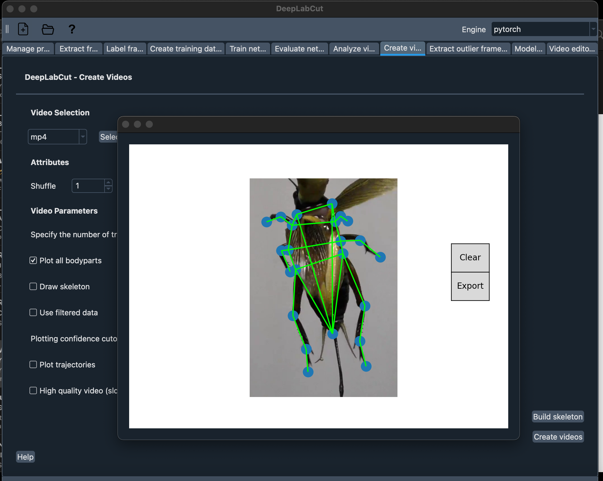
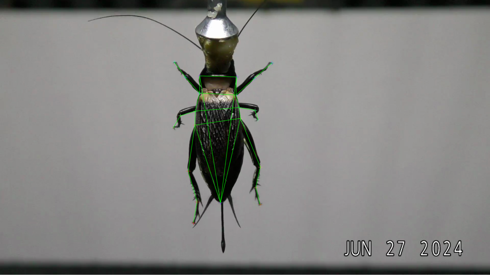

# Use DeepLabCut: A Step by Step Guide

Before we start, here's a flowchart from DLC team that give you an idea on how a DLC project works.


And, to reiterate from [last section](./Getting-started-2024.md):

| Local Job (Computationally Light) | HPC's GPU Job (Needs a GPU) | HPC's Job (CPU/Mem intensive) |
|------------------------------------|-----------------------------|-------------------------------|
| Create a project | Training a model | Create Labeled Data |
| Labelling with GUI | Evaluating model | Extracting outlier frames |
| Create training datasets | Analyzing videos | Plotting Trajectories |
|  |  | Filtering Predictions |

## [1. Create a new project](https://deeplabcut.github.io/DeepLabCut/docs/standardDeepLabCut_UserGuide.html#a-create-a-new-project)

Generally, just use the GUI to create your project. The GUI does a pretty decent job on that. If you do want to use the command line:

```python
deeplabcut.create_new_project(
    'name of project', 
    'your name', 
    ['complete file path to video(s)'], 
    working_directory='file path to where you want project saved' # optional
)
```

- additional parameter that might be useful includes:
  - `copy_videos=True/False`: which will create a reference to a video in the video directory, if you want to copy the video to the project directory, set this to True.

## [2. Extract Frames](https://deeplabcut.github.io/DeepLabCut/docs/standardDeepLabCut_UserGuide.html#c-data-selection-extract-frames)

Generally this takes minutes on your computer. I recommend the GUI.

- You will primarily use 'automatic' and 'kmeans' as the parameters, but these are default, so you don't always have to fill them in.
- If this is your second iteration, and you noticed a specific range of a video that has bad tracking, use manual and pick those frames in the GUI. (Do it on your computer!!!)
- For some reasons, this line is sensitive to case and/or the difference between double and single quote. (use `'automatic'` instead of `"automatic"` or `'Automatic'`)

Here's the command line usage:

```python
In [4]: deeplabcut.extract_frames(config_path, 'automatic/manual', 'uniform/kmeans')
"Do you want to extract (perhaps additional) frames for [file path]? yes/no" yes 
...
"Kmeans clustering (this may take a while)"
...
"Frames were successfully extracted, for the videos listed in the config.yaml file."
"You can now label the frames using the function 'label_frames' (Note, you should label frames extracted from diverse videos (and many videos; we do not recommend training on single videos!))."
```

If you are extracting frames for a second time, it will prompt you with the following

```python
"The directory already contains some frames. Do you want to add to it?(yes/no):" yes
```

After this step, you should have a folder called `labeled-data` in your project directory.

## [3. Label Frames](https://deeplabcut.github.io/DeepLabCut/docs/standardDeepLabCut_UserGuide.html#d-label-frames)

This is the most time-consuming part of the process. You will need to label the body parts of the animal in each frame. **Use the GUI for this part on your local computer**

With the GUI open, click label frames, select the folder (corresponding to the video) that you want to label, and start labeling. The startup guide that pops up should be easy to follow. The labelling UI, in it's full glory, should look like this:


> **General recommendation when Labelling**:
>
> - **Don't Label Points when the body part is not visible.** Even if you (as a human) knows where that body part if, the computer doesn't. For example, if the leg is behind the body, even if you know where the leg is, don't label it. If you really want at least some tracking, label the visble part of the leg, don't put the point in where the leg is behind the body. The computer would be able to track the leg when it's visible again.
> - **Label the same body part the same way.** If you decided that the very end of a tail is the tail, label the very end of the tail as the tail for all frames. Don't label the middle of the tail as the tail for some frames and the end of the tail as the tail for other frames. **Personally I recommend writing down a standard for future you to reference** e.g. *"I will always label the tip of the tail as the tail, when it is not visible, (I will not label it/I will label the left side of the furthest visible part of the tail as the tail)."*
> - **Similar body parts?** Create sepearate labels for them is far better than labelling more frames with the part that you're interested. E.g. it is easier for DLC to acknowledge there's two separate body part when you label both of them instead of giving DLC more examples of the same body part.

## Checking Labells and Create skeleton

Before moving on to the next step, a good practice is to check the labels. You can do this by using the `check_labels` function.

```python
In [6]: deeplabcut.check_labels(config_path)
"Creating images with labels by [your name]."
"100%|████████████████████████████████████████████████████████████████████████████| 19/19 [00:13<00:00,  1.41it/s]"
"If all the labels are ok, then use the function 'create_training_dataset' to create the training dataset!"
```

I highly recommend checking the labels before moving on to the next step.

If you got too many labels and it is kinda hard to see what's going on, having a skeleton defined in this steps helps. This function only works with the GUI. As of DLC 3.0.0rc2, the button for build skeleton is under "Create Videos".



DLC also have a youtube video on how this works: <https://youtu.be/fQSJ0S08UyY?si=8e0NGnJ9eWlV0lmI>

With the skeleton defined, when you run check labels, you would see the skeleton on the image: (I changed the color of the skeleton to green for better visibility)



## [4. Create Training Dataset](https://deeplabcut.github.io/DeepLabCut/docs/standardDeepLabCut_UserGuide.html#f-create-training-dataset-s)

## [5. Train the Network](https://deeplabcut.github.io/DeepLabCut/docs/standardDeepLabCut_UserGuide.html#g-train-the-network)
