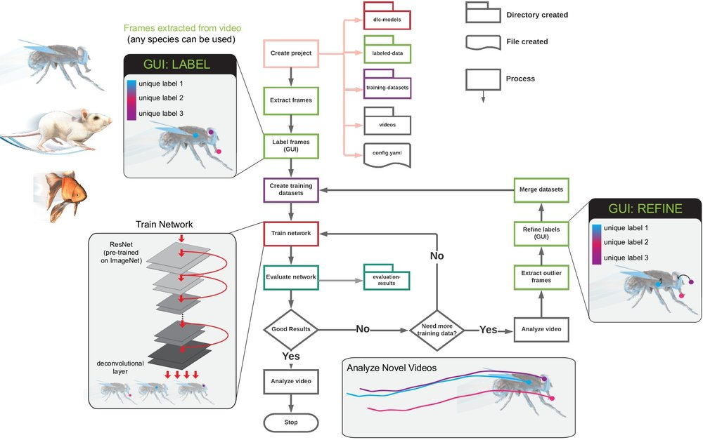

# Use DeepLabCut

Before we start, here's a flowchart from DLC team that give you an idea on how a DLC project works. 

And, to reiterate from [last section](./Getting-started-2024.md): 

| Local Job (Computationally Light) | HPC's GPU Job (Needs a GPU) | HPC's Job (CPU/Mem intensive) |
|------------------------------------|-----------------------------|-------------------------------|
| Create a project | Training a model | Create Labeled Data |
| Labelling with GUI | Evaluating model | Extracting outlier frames |
| Create training datasets | Analyzing videos | Plotting Trajectories |
|  |  | Filtering Predictions | 

# Step by Step Guide

## [Create a new project](https://deeplabcut.github.io/DeepLabCut/docs/standardDeepLabCut_UserGuide.html#a-create-a-new-project)

To create a new project, open the 